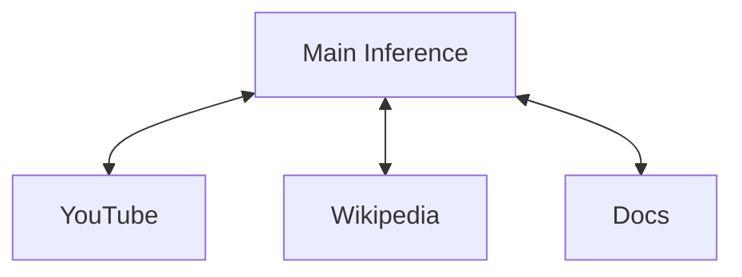

<h1 align="center" style="border:none">DiaFox</h1>

# Introduction

You probably heard of [Arc Browser](https://arc.net) ? It was nice but today it is slowly dying and **The Browser Company** shifted their focus into their new browser, [Dia Browser](https://diabrowser.com), their AI-oriented browser. But we are all disappointed as it lacks all the features we loved in Arc (vertical sidebar, folders, workspaces...) and, not only there are privacy concerns and... sooner or later it will introduce a Pro subscription while still being in beta.

Besides the criticism, the UI of Dia is enjoyable and the AI tools can be useful if paired with a good usage of skills (slash commands). The new browser of [Perplextiy](https://pplx.ai), Comet is taking a similar approach with an AI right-sidebar that you can open and has all the context it needs from the current page. 

Lately, I've been used [Zen Browser](https://github.com/zen-browser/desktop) which already has a lot of features I loved from Arc and will soon introduce folders in a similar way to Arc, a private, free and fully open-source browser based on Firefox engine and I wish I could bring the `Cmd`+`E` sidebar as easily as in Dia. So I decided to make it myself.

AI features be in all browsers and DiaFox is meant to bring these beloved features to Firefox-based browsers using the amazing free and private API of [pollinations.ai](https://pollinations). 

Below a check-list of the development progress.

# I. Check-list

## 1. Appearance

- [x] Toggle sidebar with `Cmd/Ctrl`+`Shift` + `E`
- [x] Skill auto-suggest
- [x] Tabs auto-suggest
- 1.1 Markdown
    - [x] Basic `markdown-it`
    - [x] LaTeX with MathJax
    - [ ] CodeBlocks
        - [ ] Rendering
        - [ ] Toolbar with lang and copy btn

## 2. Customization

- [x] Change accent color
- [x] Custom instructions
- [x] Create and save skills

## 3. Functionnalities

- [x] @mention tabs to add context
- [x] Get Youtube transcripts
- [ ] Chat with PDFs
- [ ] Model switcher
- [ ] Agentic capabilities (Tool-calling)

## 4. Distant future

- [ ] Use session token of AI chat services to retrieve answer
- [ ] Use local inferences with ollama

# II. Agentic capabilities

## 1. The "Thinking" mode

For each context that you attach (tabs), the tasks are splitted into multiple inferences which each inference being specialized into the tabs its given. 

Let's say... you attached three tabs. No matter how long is the context, the main inference will not read them but outsource to other agents as length of tab content can be increasingly long.

In other words, the model you're chatting with will chat with the tabs to receive the relevant informations, this could be compared as an aggressive form of chunking.

Inferences will only interact in the thinking step as the main inference identifies the needs and delegates in the thinking task.

This delegation itself is done with some tool-calling techniques.

## 2. Interactions between inferences - *Self-brainstorming*

> This is an in-progress section

Maybe you attached a bunch of tabs but none of them are required to answer. If you ask the main inference "Hello, how are you?" there is no need to look up for informations.

The main inference is provided with the names of the tabs it has access to and their respective identifier (tab id according to `browser.tabs`). If tab 28 is a YouTube video called "Where is the tomb of Alexander the Great ? | Youtube" and the user asks something related to the tomb then main inference will send a message as following:
- #28 Informations about the tomb of Alexander Great

Because of the answer starting with #, this will not mark answering state as finished, rather toggle the thinking state (visually as well). The client, receiving this answer will not only toggle the thinking mode but also send the prompt agent associated to the tab (which will already know how to compose answer, with some particularities like YouTube having special instruction to try and quote to the maximum and reference timestamp).

Answer of the agent will be sent as "user" and main inference can ask other questions, to this agents or others.

As soon as the first message not starting with `#` is sent, thinking mode is exited and the AI starts answering. 

> One difficulty I may encounter is handling these answer specifics with `stream` enabled...

# III. Pictures previews

What is it | Light mode | Dark Mode |
| - | - | - |
Appearance editor|  | 
Tabs mentionned |  |  
Tabs selector |  | 
Skill selector |  |   

# IV. What's the finality?

AI tools private, powerful and accessible for everyone.